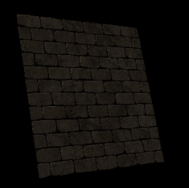
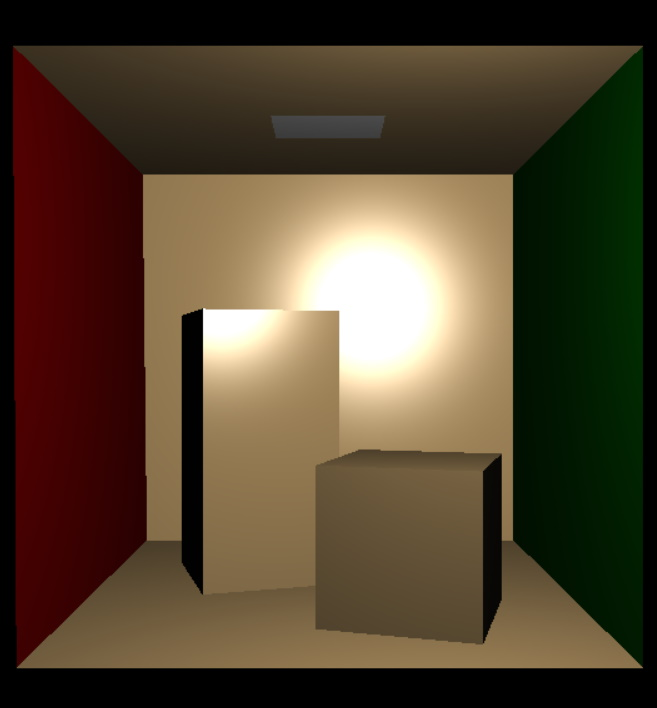
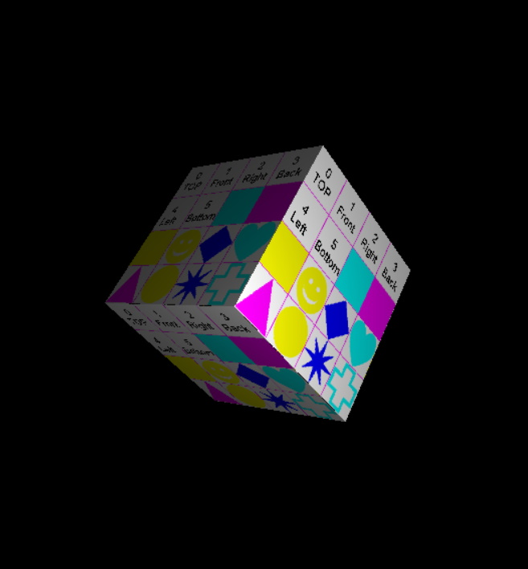
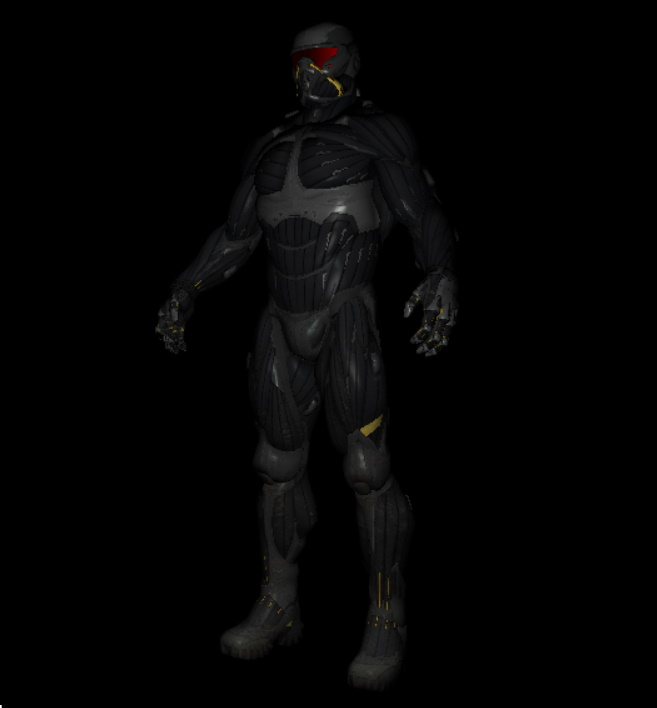
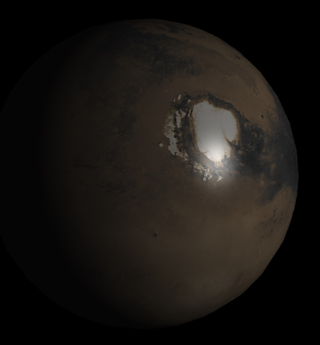
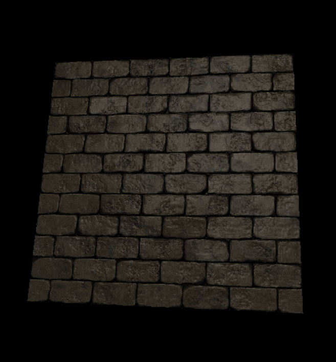

# Software Rendering Pipeline
Graphics rendering pipeline without any external graphical dependencies running fully on CPU.

  
   

# Controls
- `W/S` - camera movement.
- `Z/C` - model up/down movement.
- `E/Q` - model yaw rotation.
- `R/F` - model pitch rotation.
- `4/5/6/8` - light movement.
- `9/7` - light movement closer/further.

# Screenshots

  
       

# Features
- You can move around.
- You can rotate a model and move a point light.
- You can load and render `obj` file including materials.
- Phong reflection model.
- Phong shading.
- Texture mapping.
- Normal mapping.
- Z-buffering.
- Render to texture.
- Rendering process emulating standard GPU pipeline.

# Process
There are several stages mimicking standard pipeline.

## Input assembler
The stage itself does nothing (yet) but let you to specify the vertex and index buffers.

## Vertex shader
Vertex shader move vertices from _model space_ to _clip (projection) space_. My renderer is **right handed** in _model space_, _world space_ and _view space_ and **left handed** in _clip space_.

## Primitive assembly
From the vertices, the triangles are built in here. It is important for input `obj` mesh to be in **CCW** orientation. Culling and clipping happens here too. In a classical pipeline, the culling is more like preliminary using flags but in mine the triangle is removed if it fails `normal` test.

## Rasterizer
Transformation to _NDC_ and _screen space_, barycentric interpolation, depth test and pixel shader invocation for all related fragments. In classical pipeline, the depth test in rasterizer is in a form of early one which can be disabled based on following pixel shader procesing or via configuration. In my pipeline, the depth test here is final without any more checks later.

This part is parallelized via `std::for_each` with `std::execution::par_unseq`.

## Pixel shader
Every pixel is processed here. Texture is applied including normal map and lit according to **Phong model**. The material information can be supplemented via `mlt` file.

## Output merger
Final stage where pixel is written to an output buffer.

# Additional information
The project is built on [tPixelGameEngine](https://github.com/tucna/tPixelGameEngine) for basic window handling. 
