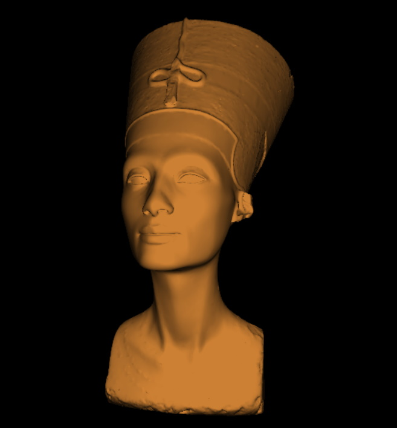

# Software Rendering Pipeline
Graphics rendering pipeline without any external graphical dependencies running fully on CPU.

  
   

# Controls
- `W/S` - camera movement.
- `E/Q` - model yaw rotation.
- `R/F` - model pitch rotation.
- `4/5/6/8` - light movement.
- `9/7` - light movement closer/further.

# Screenshots

  
       

# Features
- You can move around.
- You can rotate a model and move a light.
- You can load and render `obj` file including materials.
- Phong reflection model.
- Phong shading.
- Texture mapping.
- Normal mapping.
- Z-buffering and depth buffer handling.
- Render to texture.
- Rendering process emulating standard GPU pipeline.

# Additional information
The project is built on [tPixelGameEngine](https://github.com/tucna/tPixelGameEngine) for basic window handling. 
